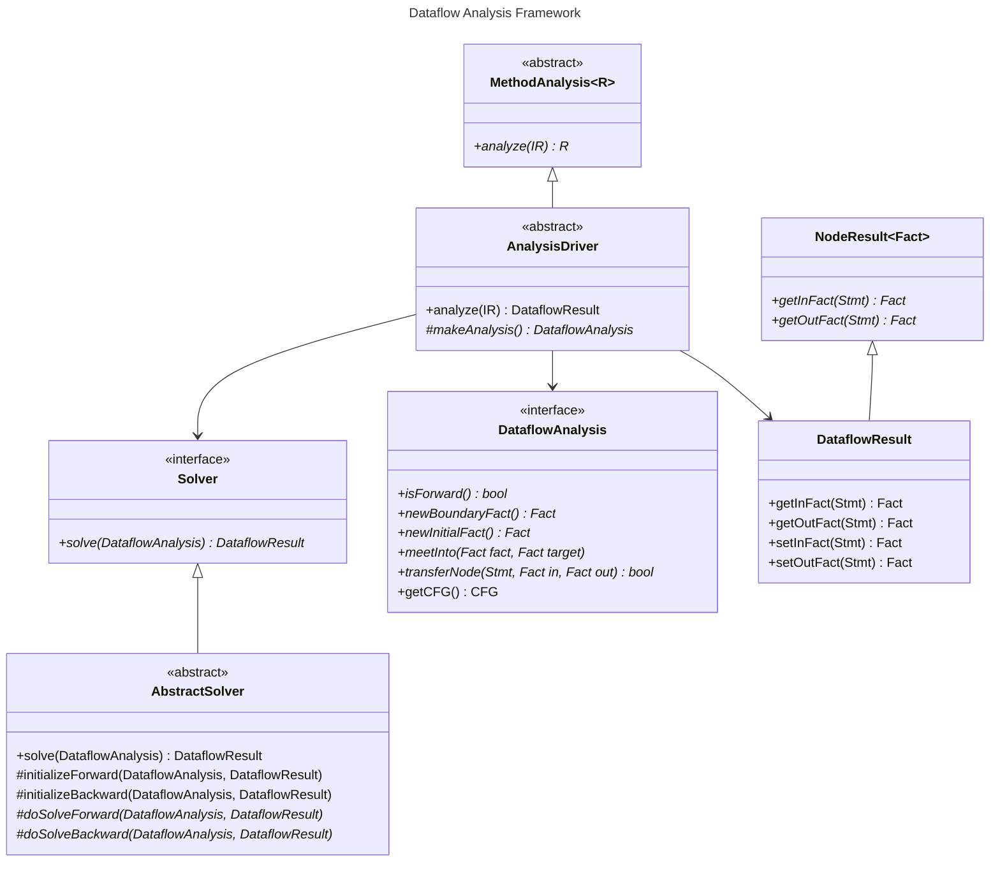

# Dataflow Analysis

> You should first read the tutorial about program representation before proceeding to this guide.

## High Level Overview of an Analysis

An analysis is an algorithm that takes a program and some configuration as input and returns some results. Typically, results are bound to statements.

You can easily create your own classes to override these interfaces in order to develop your own analysis.

## Dataflow Analysis Framework

This project provide a complete and easy-to-use framework to develop dataflow analysis.

