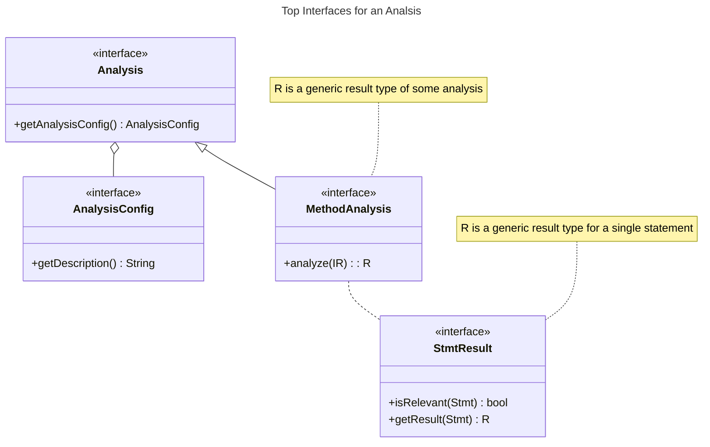

# Dataflow Analysis

> You should first read the tutorial about program representation before proceeding to this guide.

## High Level Overview of an Analysis

An analysis is an algorithm that takes a program and some configuration as input and returns some results. Typically, results are bound to statements.

