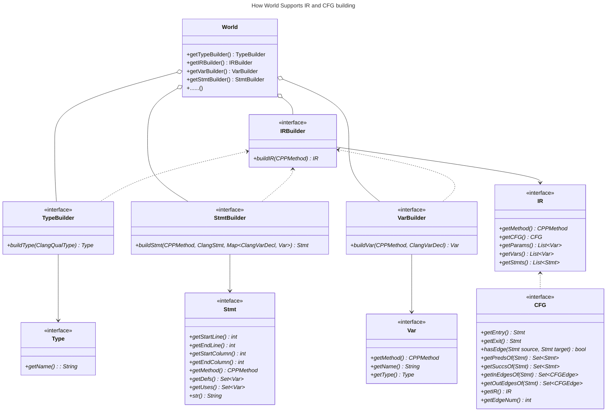

# Program Representation


> It is highly recommended that you generate API documentation first accroding to project `README` before working through this tutorial. The *API documentation* mentioned below all refers to the one generated according to project `README`.


## World

```cpp
#include "World.h"

namespace al=analyzer;
namespace lang=al::language;

al::World::initialize("resources/example01/src", "resources/example01/include");
const World& world = al::World::get();
```

All resources about the program representation is managed by the only singleton `World` object, which can be accessed through `get` static method of `World` class. And this `world` object is immutable.

A CPP program is divided into several `CPPMethod` objects when the `World` is initialized. You can get them through a bunch of methods provided by the `world` object. Several ways to get cpp methods through `world` are listed below.

```cpp
const std::unordered_map<std::string, std::shared_ptr<lang::CPPMethod>>& getAllMethods() const;
std::shared_ptr<lang::CPPMethod> getMethodBySignature(const std::string& signature) const;
std::shared_ptr<lang::CPPMethod> getMainMethod() const;
```

Refer to API documentation for more information about these methods.


## CPPMethod

A `CPPMethod` object contains all information that you'll need to perform an intra-procedural analysis or build a whole-program analysis. There's also a bunch of convenient methods provided in this class. Frequently used methods are listed below.

```cpp
const std::string& getMethodSignatureAsString() const;
std::string getMethodSourceCode() const;
std::string getContainingFilePath() const;
std::size_t getParamCount() const;
std::shared_ptr<Type> getParamType(std::size_t i) const;
const std::string& getParamName(std::size_t i) const;
std::shared_ptr<Type> getReturnType() const;
std::shared_ptr<ir::IR> getIR();
bool isGlobalMethod() const;
bool isClassStaticMethod() const;
bool isClassMemberMethod() const;
bool isVirtual() const;
```

Refer to API documentation for more detailed information about these methods.

The most important method above is `getIR`, whose first call triggers the build of intermediate representation of this method using the `IRBuilder` provided by `world`.


## IR and CFG

IR and CFG are basic infrastructures for most static analysis algorithms. The Construction of them are based on the interfaces below.



All the above interfaces have a default implementation. 

Since they are all interfaces and they all rely on interfaces, you can easily substitute my default implementation by your own implementation of one part without having to change any other part.


## How to get more details

The code of this project is well commented, documented and tested, so that the best way to get familiar with this project is **reading the tests** and meanwhile **seaching through header files and api documentations**.


